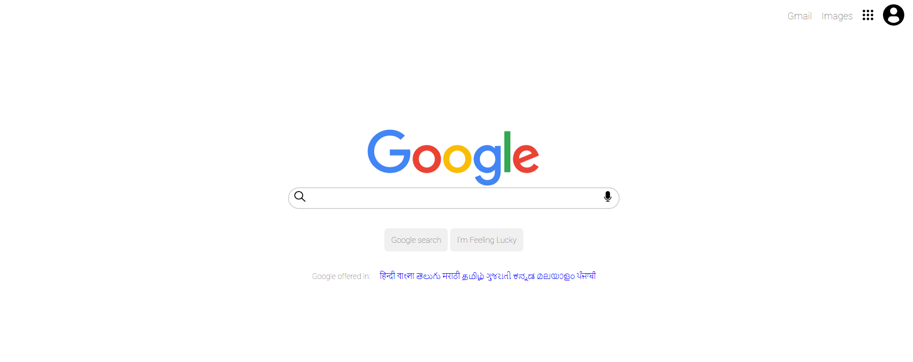

# 🌐 Google Homepage Clone

This is a simple, responsive clone of the classic **Google homepage**, built using **HTML** and **CSS**. It replicates the layout, logo placement, search bar, and footer links similar to the real Google homepage.

---

## 📸 **Demo**

 <!-- Replace with an actual screenshot of your project -->

---

## 🚀 **Features**

- Google logo and search bar layout
- Buttons styled like "Google Search" and "I'm Feeling Lucky"
- Footer links including About, Advertising, Business, etc.
- Responsive layout on desktop and mobile devices

---

## 🛠️ **Technologies Used**

- HTML5  
- CSS3

---

## 📂 **Folder Structure**

google-homepage/
├── index.html
├── style.css
├── assets/ (images, screenshots)
└── README.md

## 🔗 **Live Demo**  
**Check out the live project here:**  
[Google Homepage Clone](https://ushasreebayya.github.io/google-homepage/)

---

## 🧑‍💻 **Author**  
**Author:** Ushasree Bayya

---

## 📝 **Acknowledgements**

- **Inspired by** the original Google homepage design.  
- **Practice project** to learn HTML & CSS layout, positioning, and responsiveness.  
- **Images used** are for educational purposes only.  
- **Created as part of** my frontend development learning journey.
